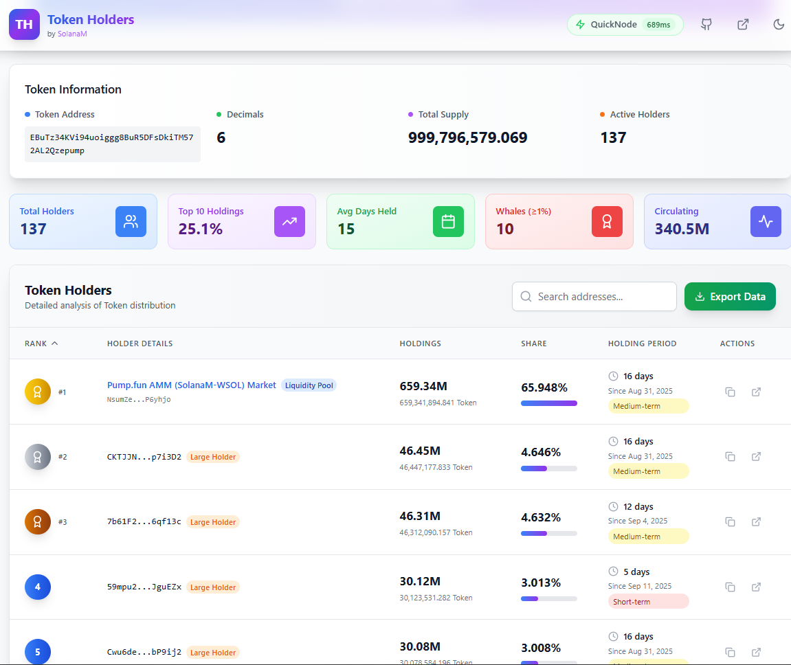

<div align="center">
  

  <p>
    <a href="https://react.dev"></a>
    <a href="https://www.typescriptlang.org/"></a>
    <a href="https://vitejs.dev/"></a>
    <a href="https://tailwindcss.com/"></a>
    <a href="https://solana.com/developers"></a>
    <a href="https://pnpm.io/"></a>
    <a href="#license"></a>
  </p>

  <p><strong>Tech stack:</strong> React + TypeScript + Vite + Tailwind · Solana Web3 RPC · Automatic endpoint failover · Mobile-first responsive design</p>
</div>

## Solana Token Holder Tracker (Pump.fun Friendly)

A modern, mobile-first React application for comprehensive analysis of Solana SPL token holders. Features professional UI/UX design, detailed holder analytics, and powerful data export capabilities. Optimized for Pump.fun launchpad tokens with automatic AMM pool detection.



### ✨ Key Features

#### 📊 **Comprehensive Analytics**
- **Detailed holder rankings** with balance, percentage ownership, and holding duration
- **Token information** including address, decimals, total supply, and active holder count
- **Holder categorization** (Whale ≥5%, Large ≥1%, Medium ≥0.1%, Small holders)
- **Holding period analysis** with color-coded badges (Long-term ≥30 days, Medium-term ≥7 days, Short-term)
- **Top 10 concentration metrics** and whale count statistics

#### 🎨 **Modern UI/UX Design**
- **Mobile-first responsive design** optimized for all screen sizes
- **Professional gradient cards** with comprehensive statistics
- **Enhanced header** with sticky navigation and backdrop blur
- **Dark mode support** with smooth transitions
- **Interactive elements** with hover effects and animations
- **Touch-friendly interface** for mobile devices

#### 📤 **Data Export Capabilities**
- **JSON Export**: Complete data structure with all holder information
- **CSV Export**: Spreadsheet-compatible format using Papa Parse
- **Excel Export**: Full-featured .xlsx files using SheetJS
- **One-click export** with dropdown menu selection

#### 🔧 **Technical Features**
- **Automatic RPC failover** with latency testing and endpoint rotation
- **Pump.fun AMM detection** with special labeling for liquidity pools
- **Real-time holder analysis** with transaction history estimation
- **Advanced search and filtering** capabilities
- **Error handling** with retry mechanisms

## Getting Started

### Prerequisites
- Node.js 18+ and pnpm (recommended) or npm
- Solana mainnet RPC URLs (Helius, QuickNode, or your own)

### Installation

1. **Clone the repository**
```bash
git clone <repository-url>
cd solana-token-holder-tracker
```

2. **Install dependencies**
```bash
pnpm install
# or
npm install
```

3. **Configure environment variables**
```bash
cp .env.example .env
```

Edit `.env` file with your configuration:
```env
# Solana RPC Configuration
VITE_HELIUS_API_KEY=your_helius_api_key_here
VITE_QUICKNODE_URL=your_quicknode_url_here
VITE_QUICKNODE_WS=your_quicknode_websocket_url_here

# Token Configuration
VITE_DEFAULT_TOKEN_ADDRESS=EBuTz34KVi94uoiggg8BuR5DFsDkiTM572AL2Qzepump
VITE_PUMPFUN_AMM_ADDRESS=NsumZem3j76AAucwXzy5kpgpvqWJJW5dK68YwP6yhjo
```

4. **Start development server**
```bash
pnpm dev
# or
npm run dev
```

5. **Build for production**
```bash
pnpm build
# or
npm run build
```

## Configuration

### Environment Variables

| Variable | Description | Required |
|----------|-------------|----------|
| `VITE_HELIUS_API_KEY` | Your Helius RPC API key | Yes |
| `VITE_QUICKNODE_URL` | Your QuickNode RPC endpoint URL | Yes |
| `VITE_QUICKNODE_WS` | Your QuickNode WebSocket endpoint | Yes |
| `VITE_DEFAULT_TOKEN_ADDRESS` | Default token address to load | No |
| `VITE_PUMPFUN_AMM_ADDRESS` | Pump.fun AMM pool address for detection | No |

### RPC Endpoints Configuration

The app automatically tests multiple RPC endpoints and uses the fastest one. You can add additional endpoints by modifying `src/services/solanaService.ts`:

```typescript
const RPC_ENDPOINTS: RPCEndpoint[] = [
  {
    name: 'Helius',
    url: `https://mainnet.helius-rpc.com/?api-key=${import.meta.env.VITE_HELIUS_API_KEY}`,
    ws: `wss://mainnet.helius-rpc.com/?api-key=${import.meta.env.VITE_HELIUS_API_KEY}`,
    latency: null
  },
  // Add more endpoints here
];
```

## How It Works

### Holder Data Retrieval
1. **Token Metadata**: Fetches token decimals and supply using `@solana/web3.js`
2. **Token Accounts**: Queries `TOKEN_PROGRAM_ID` parsed accounts filtered by mint
3. **Balance Aggregation**: Aggregates balances and sorts by amount descending
4. **Transaction History**: Requests up to 1000 signatures per account for "days held" estimation
5. **AMM Detection**: Identifies Pump.fun liquidity pools using known AMM addresses

### Export Functionality
- **JSON**: Complete holder data with all fields and metadata
- **CSV**: Comma-separated values compatible with Excel and Google Sheets
- **Excel**: Native .xlsx format with proper formatting and data types

### Mobile Optimization
- **Responsive Grid**: Adapts from 2 columns (mobile) to 5 columns (desktop)
- **Adaptive Typography**: Scales text sizes based on screen size
- **Touch Interface**: Optimized button sizes and spacing for mobile
- **Horizontal Scroll**: Table scrolls horizontally on small screens
- **Condensed Information**: Shows essential data on mobile, full details on desktop

## File Structure

```
src/
├── components/
│   ├── Header.tsx              # Enhanced sticky header with mobile nav
│   ├── TokenInput.tsx          # Token address input with validation
│   ├── HoldersTable.tsx        # Comprehensive holders table with export
│   ├── ExportButton.tsx        # Data export functionality
│   ├── LoadingSpinner.tsx      # Loading state component
│   └── ErrorMessage.tsx        # Error handling component
├── services/
│   └── solanaService.ts        # Solana blockchain interaction service
├── hooks/
│   └── useTheme.tsx           # Dark/light theme management
├── types/
│   └── index.ts               # TypeScript type definitions
└── App.tsx                    # Main application component
```

## Dependencies

### Core Dependencies
- **@solana/web3.js**: Solana blockchain interaction
- **@solana/spl-token**: SPL token program utilities
- **react** & **react-dom**: UI framework
- **lucide-react**: Modern icon library

### Export Dependencies
- **papaparse**: CSV parsing and generation
- **xlsx**: Excel file generation and manipulation

### Development Dependencies
- **vite**: Fast build tool and dev server
- **typescript**: Type safety and development experience
- **tailwindcss**: Utility-first CSS framework
- **eslint**: Code linting and quality

## Usage Examples

### Analyzing Your Pump.fun Token
1. Launch your token on Pump.fun
2. Copy the token mint address from the success page
3. Paste the address into the app input field
4. View comprehensive holder analytics and export data

### Custom Token Analysis
1. Enter any Solana SPL token mint address
2. The app will automatically detect if it's a Pump.fun token
3. View detailed holder distribution and statistics
4. Export data in your preferred format

## Troubleshooting

### Common Issues

**Empty or small holder list**
- Verify the mint address is correct and on mainnet
- Ensure the token has active holders with non-zero balances

**RPC errors or timeouts**
- Check your API keys in the `.env` file
- Verify your RPC provider quotas and limits
- The app will automatically retry with different endpoints

**Export not working**
- Ensure you have holder data loaded before exporting
- Check browser permissions for file downloads

**Mobile display issues**
- Clear browser cache and reload
- Ensure you're using a modern mobile browser

## Performance Optimization

- **Lazy loading** for large holder lists
- **Automatic RPC failover** for reliability
- **Efficient data structures** for fast sorting and filtering
- **Responsive images** and optimized assets
- **Code splitting** for faster initial load

## Security Considerations

- **Read-only operations**: No private keys or signing required
- **Environment variables**: Sensitive API keys stored securely
- **HTTPS endpoints**: All RPC connections use secure protocols
- **Input validation**: Token addresses validated before processing

## Contributing

1. Fork the repository
2. Create a feature branch (`git checkout -b feature/amazing-feature`)
3. Commit your changes (`git commit -m 'Add amazing feature'`)
4. Push to the branch (`git push origin feature/amazing-feature`)
5. Open a Pull Request

## License

MIT License. Use at your own risk. This application makes read-only RPC calls and holds no private keys.

## Support

For issues, questions, or contributions, please visit the [GitHub repository](https://github.com/solaxnm/holders) or contact the development team.

---

<div align="center">
  <p>Built with ❤️ for the Solana ecosystem</p>
  <p>
    <a href="https://solanam.com/">SolanaM</a> · 
    <a href="https://github.com/solaxnm/holders">GitHub</a>
  </p>
</div>